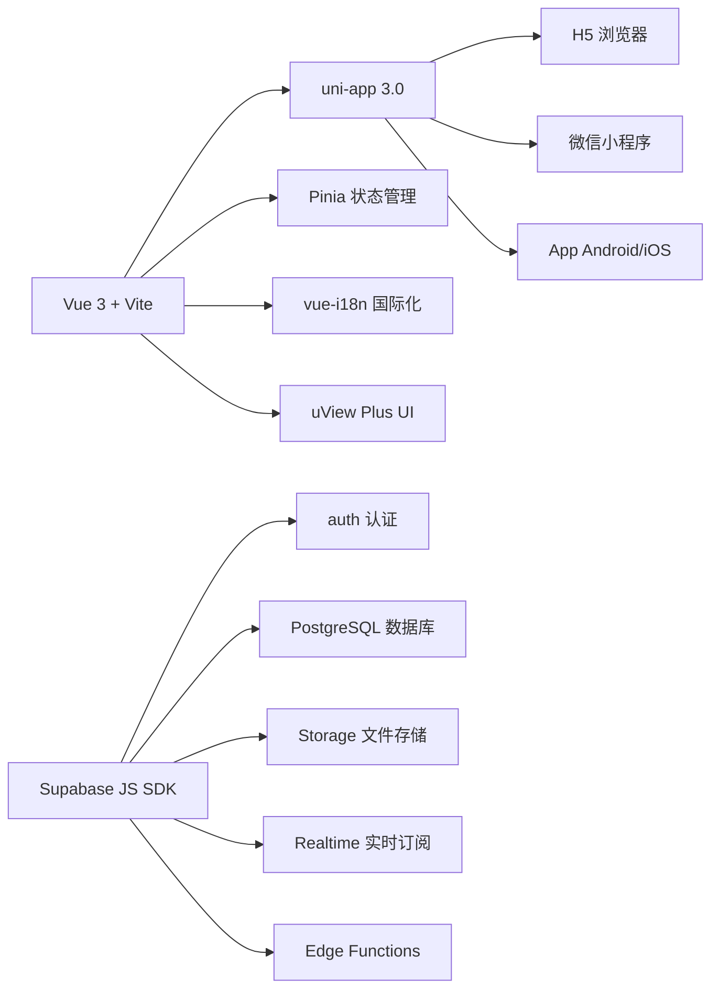

# uni-supabase-app

> uni-app + Supabase 全端通用脚手架，支持 H5、微信小程序、App 三端开发。

[](https://vuejs.org/)
[](https://www.typescriptlang.org/)
[](https://vitejs.dev/)
[](https://uniapp.dcloud.net.cn/)
[](https://supabase.com/)
[](https://pinia.vuejs.org/)

---

## 目录

- [特性](#特性)
- [技术栈](#技术栈)
- [项目结构](#项目结构)
- [快速开始](#快速开始)
- [多环境配置](#多环境配置)
- [已实现功能](#已实现功能)
- [数据库](#数据库)
- [国际化](#国际化)
- [构建部署](#构建部署)

---

## 特性

| 模块 | 说明 |
|------|------|
| 🔐 **Supabase 认证** | 邮箱注册/登录、密码重置、OAuth 第三方登录、微信小程序登录、会话自动恢复 |
| 🗄️ **PostgreSQL 数据库** | 用户资料表（profiles），完整 RLS 行级安全策略，触发器自动创建用户记录 |
| 📦 **文件存储** | 头像/公开/私密三种桶，上传、下载、删除封装 |
| 🌐 **实时订阅** | 基于 Supabase Realtime 的数据变更实时推送 |
| 🌗 **深色模式** | 浅色/深色主题切换，自动跟随系统偏好，CSS 自定义属性驱动 |
| 🌍 **国际化** | 中/英双语，vue-i18n Composition API 模式，语言偏好持久化 |
| 🛡️ **路由鉴权** | 白名单 + 登录态检查，未登录拦截并带 redirect 回跳参数 |
| 📱 **跨端适配** | H5 / 微信小程序 / App 三端，条件编译 + uni 存储适配器 |
| 🎨 **UI 组件库** | uView Plus 3.x，easycom 自动注册，SCSS 主题变量 |
| 📐 **多环境** | development / staging / production 三套环境变量 |

---

## 技术栈



| 分类 | 依赖 | 版本 |
|------|------|------|
| 框架 | `vue` | ^3.4.0 |
| 构建 | `vite` | ^5.2.0 |
| 跨端 | `@dcloudio/uni-app` | 3.0.0 |
| 语言 | `typescript` | ^5.4.0 |
| 状态管理 | `pinia` + `pinia-plugin-persistedstate` | ^3.0.4 |
| 国际化 | `vue-i18n` | ^9.14.4 |
| UI | `uview-plus` | ^3.8.39 |
| 后端服务 | `@supabase/supabase-js` | ^2.106.2 |
| 动画 | `animate.css` | ^4.1.1 |
| 日期 | `dayjs` | ^1.11.21 |
| 样式 | `sass` | ^1.86.0 |

---

## 项目结构

```
uni-supabase-app/
├── .env.development          # 开发环境变量（含 Supabase 连接信息）
├── .env.staging              # 预发布环境变量
├── .env.production           # 生产环境变量
├── index.html                # H5 端入口 HTML
├── vite.config.ts            # Vite 构建配置（别名、SCSS、代理）
├── tsconfig.json             # TypeScript 编译配置
├── package.json              # 依赖与脚本
│
├── supabase/
│   └── migrations/
│       └── 00001_init.sql    # 数据库初始化 SQL（profiles 表 + RLS + 触发器）
│
├── docs/
│   └── SUPABASE_SETUP.md     # Supabase 项目配置指南
│
└── src/
    ├── main.ts               # 应用入口（SSR App、Pinia 持久化、i18n、uView）
    ├── App.vue               # 根组件（生命周期、认证恢复、主题 CSS 变量）
    ├── pages.json            # 页面路由 + TabBar + easycom 配置
    ├── manifest.json         # uni-app 跨端配置（权限、分包等）
    ├── uni.scss              # 全局 SCSS 变量
    │
    ├── api/                  # API 层（封装 Supabase 调用，统一 { data, error } 返回）
    │   ├── auth.ts           #   认证：注册/登录/登出/OAuth/微信/重置密码
    │   ├── profile.ts        #   用户资料：查询/更新 profiles 表
    │   └── upload.ts         #   文件存储：上传/下载/删除（适配 uni 文件系统）
    │
    ├── hooks/                # 组合式函数（Composition API Hooks）
    │   ├── useAuth.ts        #   认证操作：login/register/logout/forgotPassword
    │   ├── useLang.ts        #   语言切换
    │   ├── useRealtime.ts    #   实时数据订阅
    │   ├── useSupabase.ts    #   Supabase 客户端（封装 getSupabase）
    │   └── useUpload.ts      #   文件上传（进度、压缩、预览）
    │
    ├── store/                # Pinia 状态管理
    │   ├── index.ts          #   统一导出
    │   ├── useAuthStore.ts   #   认证状态（session/user/自动恢复/持久化）
    │   ├── useAppStore.ts    #   应用全局状态（平台/网络/主题/首次启动）
    │   └── useUserStore.ts   #   用户扩展资料（profiles 表数据）
    │
    ├── middleware/
    │   └── auth.ts           # 路由鉴权中间件（白名单/拦截/redirect）
    │
    ├── config/
    │   ├── index.ts          #   统一导出
    │   ├── env.ts            #   多环境变量读取与校验
    │   ├── app.ts            #   业务常量（分页大小/超时时间/存储前缀）
    │   └── supabase.ts       #   Supabase 连接参数
    │
    ├── libs/
    │   ├── supabase.ts       #   Supabase 客户端单例（uni 存储适配器 + 自动刷新）
    │   ├── storage.ts        #   uni 存储适配器（实现 Supabase Storage 接口）
    │   └── fetch-polyfill.ts #   小程序端 fetch polyfill（基于 uni.request）
    │
    ├── locales/              # 国际化语言包
    │   ├── index.ts          #   vue-i18n 实例（默认中文，持久化语言偏好）
    │   ├── zh-CN.ts          #   中文语言包（7 个模块：common/tabBar/splash/login/…）
    │   └── en.ts             #   英文语言包（与中文包键名完全一致）
    │
    ├── types/                # TypeScript 类型定义
    │   ├── api.ts            #   API 通用返回格式 ApiResponse<T>
    │   ├── auth.ts           #   认证相关类型（LoginParams/RegisterParams/…）
    │   ├── database.ts       #   Supabase 数据库类型（Profiles/Database）
    │   ├── global.d.ts       #   全局类型声明
    │   └── component.d.ts    #   组件类型声明
    │   └── components/       #   组件 Props 类型
    │
    ├── utils/                # 工具函数
    │   ├── date.ts           #   日期格式化（基于 dayjs）
    │   ├── logger.ts         #   日志工具
    │   ├── platform.ts       #   平台检测
    │   ├── storage.ts        #   本地存储封装
    │   ├── url.ts            #   URL 处理
    │   └── validate.ts       #   表单验证（邮箱/密码/手机号）
    │
    ├── pages/                # 页面
    │   ├── splash/           #   启动页（品牌展示 + 自动跳转）
    │   ├── index/            #   首页（功能卡片展示）
    │   ├── auth/             #   认证模块
    │   │   ├── login/        #     登录页（邮箱 + OAuth）
    │   │   ├── register/     #     注册页
    │   │   └── forgot-password/ # 找回密码页
    │   ├── user/             #   个人中心
    │   └── settings/         #   设置页（深色模式/语言/通知）
    │
    ├── components/           # 公共组件（easycom c-* 自动注册）
    │   ├── auth-guard/       #   认证守卫组件
    │   ├── custom-navbar/    #   自定义导航栏
    │   ├── empty-state/      #   空状态占位
    │   └── page-loading/     #   页面加载中
    │
    └── static/               # 静态资源
        ├── images/           #   图片（logo/default-avatar/empty）
        └── tabbar/           #   TabBar 图标（home/user 的默认+激活态）
```

---

## 快速开始

### 前置条件

- **Node.js** ≥ 18.x
- **npm** / yarn / pnpm
- 一个 [Supabase](https://supabase.com) 项目（免费套餐即可）

### 1. 克隆项目 & 安装依赖

```bash
git clone <repo-url>
cd uni-supabase-app
npm install
```

### 2. 配置 Supabase

参考 [docs/SUPABASE_SETUP.md](docs/SUPABASE_SETUP.md)：

1. 在 Supabase Dashboard 创建项目
2. 在 **Settings → API** 复制 `Project URL` 和 `anon public key`
3. 编辑 `.env.development`，填入你的 Supabase 信息：

```env
VITE_SUPABASE_URL=https://your-project.supabase.co
VITE_SUPABASE_PUBLISHABLE_KEY=sb_publishable_xxxxxxxxxx
VITE_APP_ENV=development
```

4. 在 Supabase SQL Editor 中执行 `supabase/migrations/00001_init.sql`
5. Dashboard → Authentication → Providers → 启用 **Email** 提供商
6. Dashboard → Storage → 创建三个存储桶：`avatars`、`public`、`private`

### 3. 启动开发服务器

```bash
# H5 端（浏览器）
npm run dev:h5

# 微信小程序
npm run dev:mp-weixin

# App 端
npm run dev:app
```

H5 端默认访问地址：`http://localhost:5173`

---

## 多环境配置

项目通过 `.env.*` 文件区分环境，Vite 的 `--mode` 参数决定加载哪个文件：

| 环境 | 命令 | 变量文件 |
|------|------|----------|
| 🧪 开发 | `npm run dev:h5` | `.env.development` |
| 🧪 开发 | `npm run dev:mp-weixin` | `.env.development` |
| 🚧 预发布 | `npm run build:h5:staging` | `.env.staging` |
| 🚀 生产 | `npm run build:h5:prod` | `.env.production` |

### 环境变量清单

| 变量名 | 必填 | 说明 |
|--------|:--:|------|
| `VITE_SUPABASE_URL` | ✅ | Supabase 项目 URL |
| `VITE_SUPABASE_PUBLISHABLE_KEY` | ✅ | Supabase 可发布密钥（前端安全，受 RLS 保护） |
| `VITE_APP_ENV` | - | 运行环境标识：`development` / `staging` / `production` |
| `VITE_APP_NAME` | - | 应用名称，默认 `uni-supabase-app` |
| `VITE_APP_API_BASE` | - | API 基础路径，默认自动拼接（通常无需修改） |

> ⚠️ **安全红线**：永远不要将 `service_role key` 或 `JWT secret` 放在以 `VITE_` 开头的前端环境变量中！这些值会编译进前端代码，完全公开可见。

---

## 已实现功能

### 认证模块

| 功能 | API 方法 | 说明 |
|------|----------|------|
| 邮箱注册 | `signUpWithEmail()` | 支持自动发送确认邮件，可选 `user_metadata` 传递用户名 |
| 邮箱登录 | `signInWithEmail()` | 返回 session + user，自动持久化 |
| 登出 | `signOut()` | 清除服务端 + 本地会话 |
| 密码重置 | `resetPassword()` | 发送重置邮件到注册邮箱 |
| 修改密码 | `updatePassword()` | 登录后修改密码 |
| OAuth 登录 | `signInWithOAuth()` | Google / GitHub / Apple 等第三方登录 |
| 微信小程序登录 | `signInWithWechat()` | 通过 Supabase Edge Function `wechat-login` |
| 会话恢复 | `authStore.init()` | App 启动时自动从本地存储恢复，token 过期自动刷新 |
| 认证状态监听 | `onAuthStateChange` | 全局监听，多标签页同步登录态 |

### 数据流

```
用户操作 → hooks/useAuth.ts → api/auth.ts → Supabase SDK → Supabase 后端
                     ↓
              store/useAuthStore （更新状态 + 自动持久化到本地存储）
                     ↓
              所有组件响应式更新
```

### 页面对照

| 路径 | 页面 | 鉴权要求 |
|------|------|:--:|
| `pages/splash/index` | 启动页 | 无 |
| `pages/index/index` | 首页（TabBar） | 需登录 |
| `pages/auth/login/index` | 登录 | 无（已登录自动跳转首页） |
| `pages/auth/register/index` | 注册 | 无 |
| `pages/auth/forgot-password/index` | 找回密码 | 无 |
| `pages/user/index` | 个人中心（TabBar） | 需登录 |
| `pages/settings/index` | 设置 | 需登录 |

---

## 数据库

### profiles 表结构

| 字段 | 类型 | 说明 |
|------|------|------|
| `id` | `UUID` | 主键，关联 `auth.users.id` |
| `username` | `TEXT` | 用户名（可为空） |
| `avatar_url` | `TEXT` | 头像 URL |
| `phone` | `TEXT` | 手机号 |
| `bio` | `TEXT` | 个人简介 |
| `created_at` | `TIMESTAMPTZ` | 创建时间（自动） |
| `updated_at` | `TIMESTAMPTZ` | 更新时间（自动） |

### RLS 策略

- **SELECT**：所有人可查看公开资料 → `USING (true)`
- **UPDATE**：用户只能修改自己的资料 → `USING (auth.uid() = id)`
- **INSERT**：用户只能创建自己的资料 → `WITH CHECK (auth.uid() = id)`

### 触发器

- `on_auth_user_created`：新用户注册后自动在 `profiles` 表插入记录
- `on_profile_updated`：更新资料时自动更新 `updated_at` 时间戳

---

## 国际化

支持中文（zh-CN）和英文（en），默认中文。语言包按页面/模块分组的嵌套结构：

```ts
// 模板中使用
{{ $t('login.title') }}        // "欢迎回来" / "Welcome Back"
{{ $t('home.features.auth.desc') }}

// 脚本中使用
import { useI18n } from 'vue-i18n'
const { t } = useI18n()
t('common.confirm')
```

语言偏好通过 `useLang` hook 管理，切换后自动持久化到本地存储。

---

## 构建部署

### H5 端

```bash
# 构建测试环境
npm run build:h5:staging

# 构建生产环境
npm run build:h5:prod
```

构建产物在 `dist/build/h5/` 目录，可直接部署到 Nginx / CDN / 静态托管服务。

### 微信小程序

```bash
# 构建生产版本
npm run build:mp-weixin:prod
```

构建产物在 `dist/build/mp-weixin/`，用微信开发者工具打开后上传审核。

### App 端

```bash
npm run build:app
```

使用 HBuilder X 或离线打包发布。

### 类型检查

```bash
npm run type-check
```

---

## 开发约定

- **API 返回格式**：所有 API 方法统一返回 `{ data, error, status }` 结构（类型 `ApiResponse<T>`）
- **分层职责**：`api/` 只做网络请求，不涉及 UI；`hooks/` 调用 API + 更新 Store + Toast + 跳转
- **组件注册**：`c-*` 前缀公共组件通过 `pages.json` 的 easycom 自动注册，无需手动 import
- **CSS 主题**：所有颜色使用 `var(--xxx)` 引用，`App.vue` 中通过 `page.theme-dark` 覆盖深色值
- **存储键名**：统一使用 `uni_supabase_` 前缀，定义在 `config/app.ts` 中的 `STORAGE_PREFIX`

---

## 许可证

MIT
